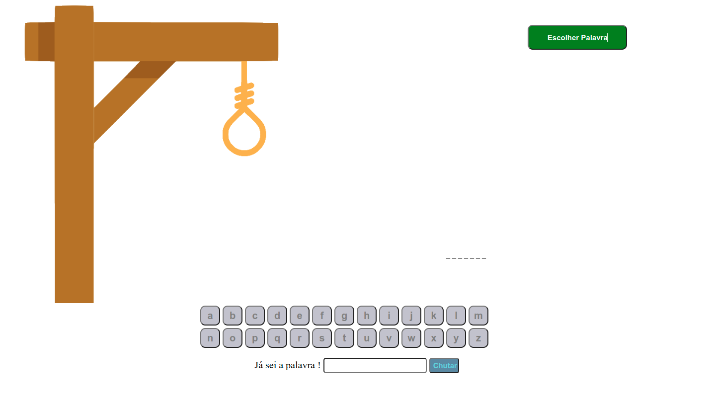

# Jogo da Forca
O objetivo deste projeto é criar um jogo da forca para aprender a usar os estados no React. O jogo consiste em adivinhar uma palavra oculta, inserindo letras uma a uma, até que a palavra completa seja revelada ou que o jogador erre o número máximo de tentativas. Durante o desenvolvimento do jogo, foram utilizados os conceitos de estado (state) no React para controlar a exibição das letras inseridas, a quantidade de tentativas restantes e o resultado final do jogo.




## Como rodar o projeto

1. Clone esse repositório 

2. Instalar as dependências 


```
npm install
```

Rode o projeto

```
npm start
```


